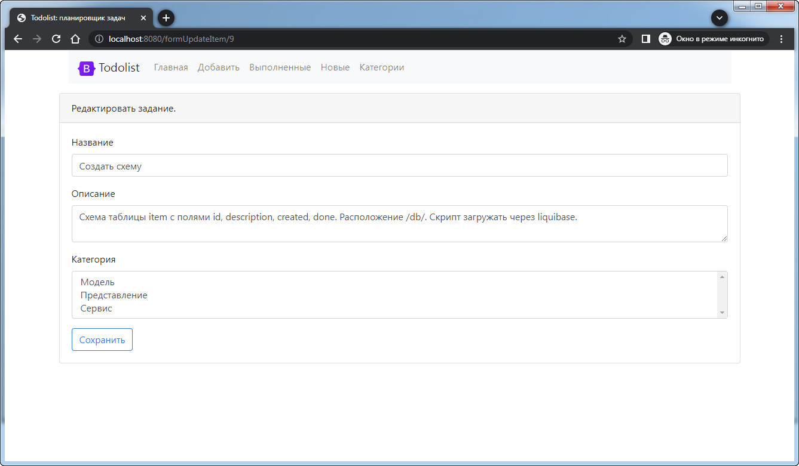
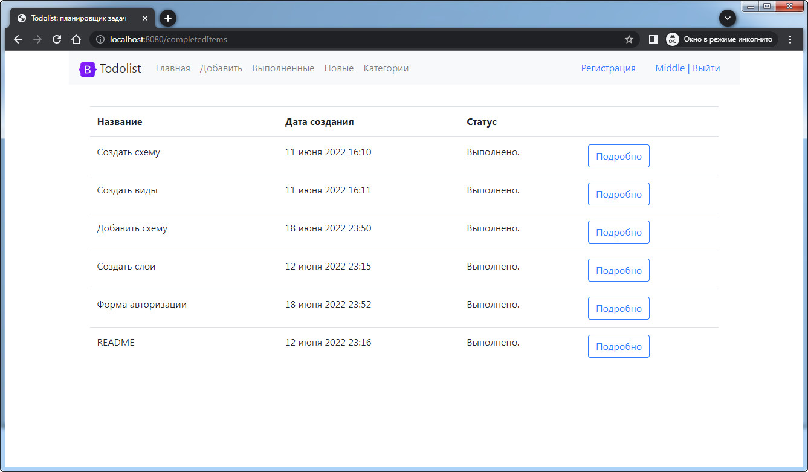

# Todolist

## Общее описание:

Веб-сервис для управления задачами.

***

## Реализовано:
* Регистрация/Вход
* Добавление задач с выбором категорий, редактирование, удаление
* Список выполненных задач
* Список новых задач, которые не старше суток

***

## Технологии:

***

## Запуск проекта:
* maven install
* java -jar target/job4j_todo-1.0.jar
* Перейти по ссылке http://localhost:8080/items

***

## Структура сайта:

### Главная страница. Список всех задач.

### Проверка доступа. Только авторизованный пользователь может подробно смотреть и добавлять задачи.

### Регистрация. Добавление нового пользователя.

### Страница добавления новой задачи с возможностью выбора нескольких категорий.

### Подробное описания задачи с указанием автора, с возможностью редактирования, удаления и отметить как выполненное.

### Страница редактирования задания.

### Страница добавления и удаления категорий.

### Список выполненных задач.

### Список новых задач, которые не старше суток.

