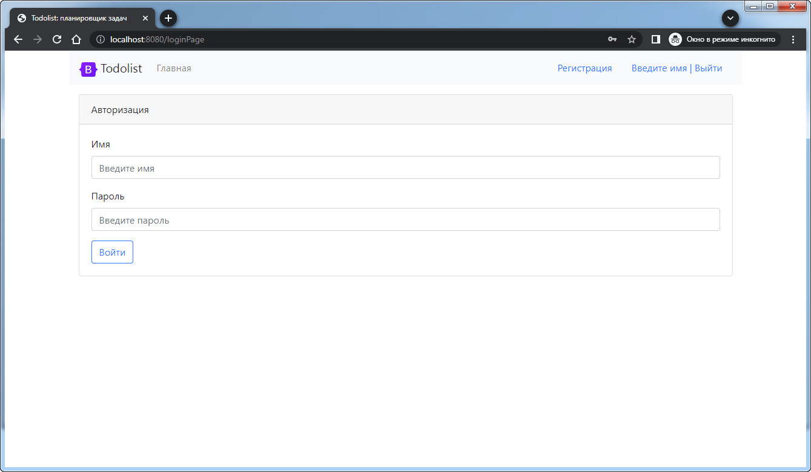
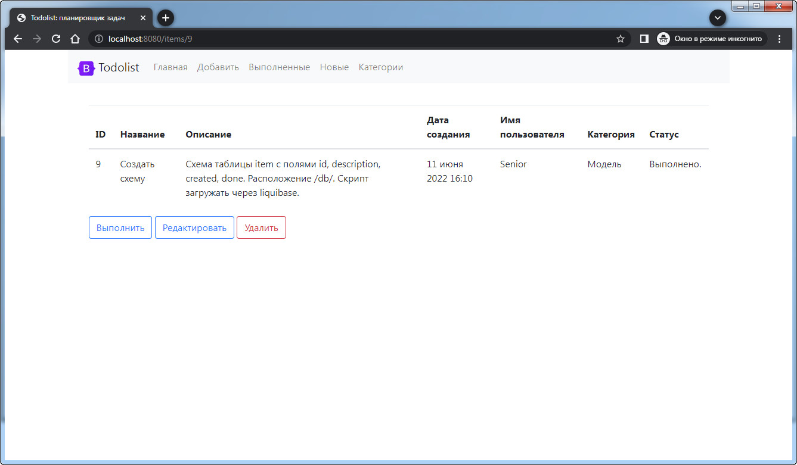
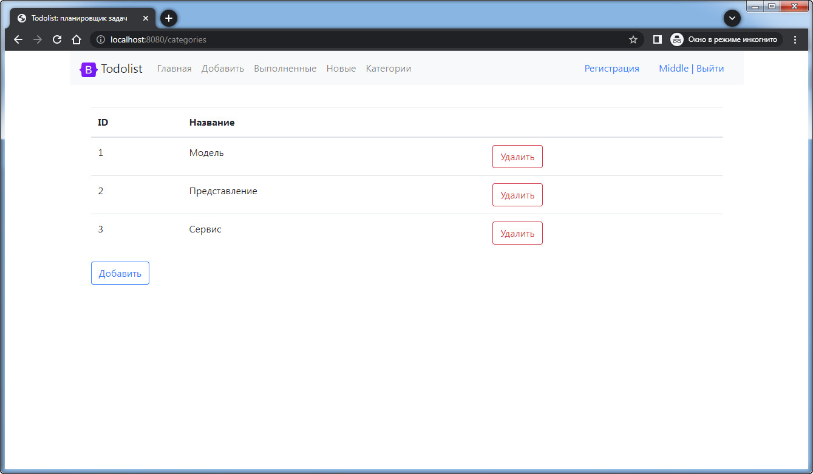

# job4j_todo

# Todolist — веб-сервис для управления задачами.

### 1. Главная страница. Список всех задач.

### 2. Проверка доступа. Только авторизованный пользователь может подробно смотреть и добавлять задачи.

### 3. Регистрация. Добавление нового пользователя.

### 4. Подробное описания задачи с указанием автора, с возможностью редактирования, удаления и отметить как выполненное.

### 5. Страница редактирования задания.

### 6. Страница добавления новой задачи.

### 7. Список выполненных задач.

### 8. Список новых задач, которые не старше суток.
